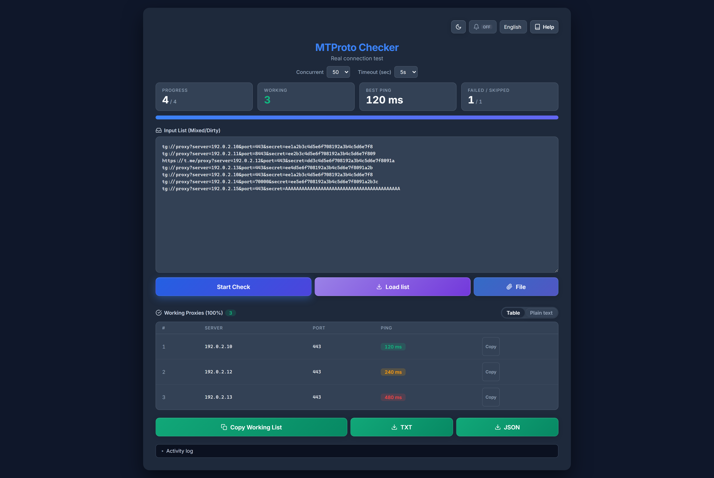

# 🛡️ MTProto Checker

[Read in English](README.md) | [На русском](README_RU.md) | [中文](README_ZH.md) | [فارسی](README_FA.md)

A powerful tool to verify **Telegram MTProto Proxies** by performing real protocol handshakes. Unlike simple TCP checkers, this tool attempts to fetch the actual server configuration from Telegram via the proxy, ensuring 100% connectivity and eliminating the "Connecting..." issue.



## 🌟 Features

* **Deep inspection:** A real MTProto handshake and a `help.getNearestDC` call through the proxy — not a TCP ping — so "working" means Telegram actually connects.
* **Go backend:** Powered by `gotd/td` — fast, stable, one ~21MB binary with no dependencies.
* **Paste anything:** Dirty lists are cleaned automatically — mangled `tg://` / `https://t.me` links are fixed, spam secrets and invalid ports dropped — and no phone login is needed (public test keys).
* **Three ways to load a list:** Paste it, pick a `.txt`/`.csv`/`.list` file, or drag one onto the input box.
* **Pause & resume:** Interrupt a scan and continue where it left off without rechecking.
* **Results ready to use:** Working proxies land in a table sorted by ping, with per-row copy, a plain-text view, and TXT/JSON export.
* **Interface:** Dark & light themes, four languages (English, Persian, Russian, Chinese).

## 🚀 Installation

### Option 1 — Download from Releases

Download the pre-built binary for your platform from [Releases](../../releases).

| Platform | File |
|----------|------|
| Windows (amd64) | `mtproto-checker-windows-amd64.exe` |
| Linux (amd64) | `mtproto-checker-linux-amd64` |
| Linux (arm64) | `mtproto-checker-linux-arm64` |
| macOS (Intel) | `mtproto-checker-darwin-amd64` |
| macOS (Apple Silicon) | `mtproto-checker-darwin-arm64` |

Run the binary. Once the server is listening, your browser opens automatically at the bound address (default `http://127.0.0.1:3000`). Set `NO_BROWSER=1` to disable the auto-open; it is also skipped automatically when `HOST` is set to a non-loopback address (e.g. a headless server with `HOST=0.0.0.0`). If the launch fails, the server keeps running — open the printed address manually.

> The server listens on `127.0.0.1` only. Set the `PORT` environment variable to change the port, and `HOST=0.0.0.0` to expose it to the network — there is no authentication, so opt in deliberately.

### Option 2 — Build from Source

Requires **Go 1.26.3+** (matches the `go` directive in `go.mod`). [Download Go](https://go.dev/dl/).

```bash
git clone https://github.com/rahgozar94725/MTProto-Checker.git
cd MTProto-Checker
go build -o mtproto-checker .
./mtproto-checker
```

> Binary: ~21MB, no other dependencies.

## 📖 How to Use

1.  **Get Proxies:** Copy your list of mixed/dirty MTProto proxies.
    > **Tip:** You can find a huge list of free proxies in [this repository](https://github.com/SoliSpirit/mtproto).
2.  **Load the List:** Paste into the **"Input List"** box, click **"File"**, or drag a file onto the box.
3.  **Start Check:** Click the **"Start Check"** button.
4.  **Wait:** Invalid formats are filtered out first, then every proxy is checked concurrently and each result streams back the moment it lands. The four tiles above the input — progress, working, best ping, failed/skipped — update as it goes.
5.  **Collect Results:** Working proxies appear in the results table, fastest first — copy a single row, click **"Copy Working List"**, or export as TXT/JSON.

## 🔌 HTTP API

The UI uses `POST /check-stream` (Server-Sent Events). For scripts, `POST /check` is the supported endpoint — one proxy per request:

```bash
curl -s http://127.0.0.1:3000/check \
  -H 'Content-Type: application/json' \
  -d '{"server":"1.2.3.4","port":443,"secret":"ee...","timeout":10}'
# {"ok":true,"ping":123}  or  {"ok":false}
```

`timeout` is in seconds, clamped to 3–30 (default 5). Request bodies are capped at 8 MiB, and batch requests accept at most 10 000 proxies (HTTP `413` beyond either limit).

> `POST /check-batch` is **deprecated**: it still works but answers with a `Deprecation: true` header and will be removed in a future release. Use `/check` for scripting or `/check-stream` for streaming results.

## ⚙️ How it Works

This tool spins up a real Telegram client in the background and connects exactly like the phone app does — if it succeeds, the proxy definitely works. Many proxies respond to TCP pings but fail to encrypt/decrypt Telegram packets (fake proxies).

1.  **Parses & Sanitizes:** Cleans up broken links (e.g., `.&port` typos).
2.  **Validates Secret:** Rejects secrets that are too long (spam padding) or invalid.
3.  **Connects:** Establishes a secure MTProto connection through the proxy.
4.  **Invokes API:** Sends a `help.getNearestDC` request to Telegram Data Centers.
5.  **Result:** If the server replies, the proxy is marked as **Working** with its latency.

## 🛠 Tech

* [gotd/td](https://github.com/gotd/td) — MTProto API client with native MTProxy support
* Vanilla HTML/CSS/JS frontend — no frameworks, no build step
* Single binary, no external dependencies

## ☕ Support

If you found this tool useful, you can support the development:

<a href="https://nowpayments.io/donation?api_key=d824db3b-fcf7-4ebb-8e3d-297c23cfeee2" target="_blank" rel="noreferrer noopener">
    
</a>

## 📝 License

This project is open-source and available under the [MIT License](LICENSE).
