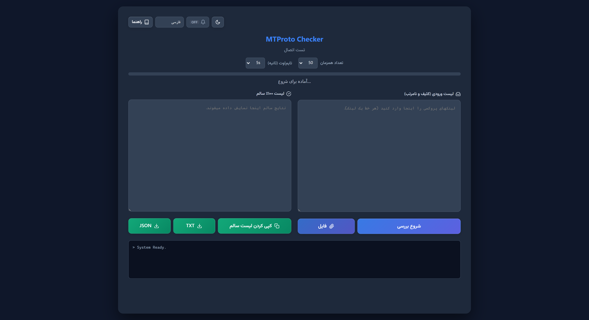

# 🛡️ MTProto Checker

[English](README.md) | [На русском](README_RU.md) | [中文](README_ZH.md) | [فارسی](README_FA.md)

یک ابزار قدرتمند و سبک برای تست واقعی پروکسی‌های تلگرام. برخلاف اکثر چکرها که فقط «پینگ» می‌گیرند، این ابزار واقعاً تلاش می‌کند اطلاعات را از سرور تلگرام دانلود کند. اگر پروکسی در این برنامه «سالم» نشان داده شود، یعنی **۱۰۰٪ در تلگرام وصل می‌شود** و روی حالت `Connecting` گیر نمی‌کند.



## ✨ ویژگی‌ها

* **تست عمیق:** هندشیک واقعی MTProto و فراخوانی `help.getNearestDC` از داخل پروکسی — نه پینگ TCP — یعنی «سالم» واقعاً یعنی تلگرام وصل می‌شود.
* **بک‌اند Go:** ساخته‌شده با `gotd/td` — سریع، پایدار، یک باینری ~21MB بدون وابستگی.
* **هرچه دارید جای‌گذاری کنید:** لیست‌های کثیف خودکار تمیز می‌شوند — لینک‌های بهم‌ریخته `tg://` و `https://t.me` اصلاح و سکرت‌های اسپم و پورت‌های نامعتبر حذف می‌شوند — و نیازی به ورود با شماره تلفن نیست (کلیدهای تست عمومی).
* **سه راه برای وارد کردن لیست:** جای‌گذاری متن، انتخاب فایل `.txt`/`.csv`/`.list` یا کشیدن و رها کردن فایل روی کادر ورودی.
* **توقف و ادامه:** بررسی را متوقف کنید و بدون تست دوباره از همان‌جا ادامه دهید.
* **نتایج آماده استفاده:** پروکسی‌های سالم در جدولی مرتب بر اساس پینگ می‌نشینند — با کپی تک‌ردیفی، نمای متن ساده و خروجی TXT/JSON.
* **رابط کاربری:** تم تیره و روشن، چهار زبان (فارسی، انگلیسی، روسی، چینی).

## 📦 نصب و راه‌اندازی

### گزینه ۱ — دانلود از ریلیز

فایل باینری آماده برای سیستم‌عامل خود را از [بخش Release](../../releases) دانلود کنید.

| سیستم‌عامل | فایل |
|------------|------|
| ویندوز (amd64) | `mtproto-checker-windows-amd64.exe` |
| لینوکس (amd64) | `mtproto-checker-linux-amd64` |
| لینوکس (arm64) | `mtproto-checker-linux-arm64` |
| مک (Intel) | `mtproto-checker-darwin-amd64` |
| مک (Apple Silicon) | `mtproto-checker-darwin-arm64` |

فایل را اجرا کنید. به محض بالا آمدن سرور، مرورگر به صورت خودکار در آدرس متصل‌شده (به طور پیش‌فرض `http://127.0.0.1:3000`) باز می‌شود. برای غیرفعال کردن باز شدن خودکار، متغیر محیطی `NO_BROWSER=1` را تنظیم کنید؛ همچنین وقتی `HOST` روی آدرسی غیر از loopback تنظیم شده باشد (مثلاً سرور بدون رابط گرافیکی با `HOST=0.0.0.0`) این کار خودکار انجام نمی‌شود. اگر باز شدن مرورگر ناموفق باشد، سرور به کار خود ادامه می‌دهد — آدرس چاپ‌شده را دستی باز کنید.

> سرور فقط روی `127.0.0.1` گوش می‌دهد. برای تغییر پورت، متغیر محیطی `PORT` را تنظیم کنید و برای در دسترس قرار دادن آن در شبکه از `HOST=0.0.0.0` استفاده کنید — احراز هویتی وجود ندارد، پس آگاهانه فعال کنید.

### گزینه ۲ — بیلد از سورس

نیازمند **Go 1.26.3+** (مطابق با دستور `go` در فایل `go.mod`). [دانلود Go](https://go.dev/dl/).

```bash
git clone https://github.com/rahgozar94725/MTProto-Checker.git
cd MTProto-Checker
go build -o mtproto-checker .
./mtproto-checker
```

> باینری: ~21MB، بدون وابستگی دیگر.

## 📖 راهنمای استفاده

1.  **دریافت پروکسی:** لیست پروکسی‌های خود را آماده کنید.
    > **نکته:** برای دریافت لیست بزرگی از پروکسی‌های رایگان می‌توانید از [این ریپازیتوری](https://github.com/SoliSpirit/mtproto) استفاده کنید.
2.  **وارد کردن لیست:** متن را در کادر **«لیست ورودی»** جای‌گذاری کنید، دکمه **«فایل»** را بزنید، یا فایل را روی کادر بکشید و رها کنید.
3.  **شروع:** روی دکمه **«شروع بررسی»** کلیک کنید.
4.  **صبر کنید:** ابتدا فرمت‌های نامعتبر حذف می‌شوند، سپس همهٔ پروکسی‌ها هم‌زمان بررسی می‌شوند و نتیجهٔ هرکدام همان لحظه می‌رسد. چهار کاشی بالای کادر ورودی — پیشرفت، سالم، بهترین پینگ، ناموفق/ردشده — همان‌طور که پیش می‌رود به‌روز می‌شوند.
5.  **برداشت نتایج:** پروکسی‌های سالم در جدول نتایج، سریع‌ترین اول، ظاهر می‌شوند — یک ردیف را کپی کنید، **«کپی کردن لیست سالم»** را بزنید یا خروجی TXT/JSON بگیرید.

## 🔌 HTTP API

رابط کاربری از `POST /check-stream` (رویدادهای SSE) استفاده می‌کند. برای اسکریپت‌ها، اندپوینت پشتیبانی‌شده `POST /check` است — هر درخواست یک پروکسی:

```bash
curl -s http://127.0.0.1:3000/check \
  -H 'Content-Type: application/json' \
  -d '{"server":"1.2.3.4","port":443,"secret":"ee...","timeout":10}'
# {"ok":true,"ping":123}  یا  {"ok":false}
```

`timeout` بر حسب ثانیه است و به بازه ۳ تا ۳۰ محدود می‌شود (پیش‌فرض ۵). بدنه درخواست حداکثر ۸ مگابایت است و درخواست‌های دسته‌ای حداکثر ۱۰٬۰۰۰ پروکسی می‌پذیرند (عبور از هر کدام: HTTP `413`).

> اندپوینت `POST /check-batch` **منسوخ** شده است: هنوز کار می‌کند اما پاسخ آن هدر `Deprecation: true` دارد و در نسخه‌های بعدی حذف خواهد شد. برای اسکریپت از `/check` و برای نتایج لحظه‌ای از `/check-stream` استفاده کنید.

## ⚙️ روش کار

این ابزار یک «کلاینت واقعی تلگرام» در پس‌زمینه می‌سازد و دقیقاً مثل اپلیکیشن گوشی به دیتاسنتر وصل می‌شود — اگر موفق شود، یعنی پروکسی قطعاً کار می‌کند. بسیاری از پروکسی‌ها به پینگ TCP جواب می‌دهند اما نمی‌توانند بسته‌های تلگرام را رمزنگاری/رمزگشایی کنند (پروکسی فیک).

1.  **پارس و پاک‌سازی:** لینک‌های خراب اصلاح می‌شوند (مثلاً غلط تایپی `.&port`).
2.  **اعتبارسنجی سکرت:** سکرت‌های بیش از حد بلند (اسپم) یا نامعتبر رد می‌شوند.
3.  **اتصال:** یک اتصال امن MTProto از طریق پروکسی برقرار می‌شود.
4.  **فراخوانی API:** درخواست `help.getNearestDC` به دیتاسنتر تلگرام ارسال می‌شود.
5.  **نتیجه:** اگر سرور پاسخ دهد، پروکسی به عنوان **سالم** همراه با تأخیرش علامت می‌خورد.

## 🛠 تکنولوژی‌ها

* [gotd/td](https://github.com/gotd/td) — کلاینت MTProto API با پشتیبانی بومی از MTProxy
* فرانت‌اند Vanilla HTML/CSS/JS — بدون فریم‌ورک، بدون مرحله build
* یک باینری، بدون وابستگی خارجی

## ☕ حمایت (Donation)

اگر این ابزار برایتان مفید بود، می‌توانید از طریق لینک زیر حمایت کنید:

<a href="https://nowpayments.io/donation?api_key=d824db3b-fcf7-4ebb-8e3d-297c23cfeee2" target="_blank" rel="noreferrer noopener">
    
</a>

## 📄 لایسنس

این پروژه متن‌باز (Open Source) است و تحت لایسنس [MIT](LICENSE) منتشر شده است.
