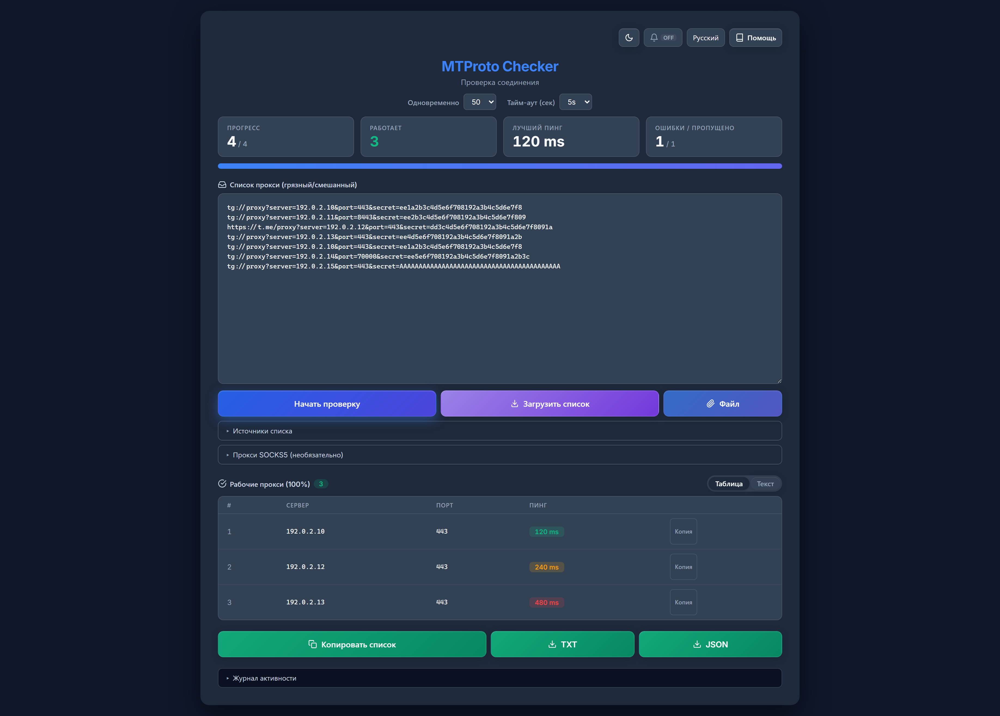

# 🛡️ MTProto Checker

[Read in English](README.md) | [На русском](README_RU.md) | [中文](README_ZH.md) | [فارسی](README_FA.md)

Инструмент для проверки **Telegram MTProto прокси** с выполнением реального рукопожатия протокола. В отличие от простых TCP-чекеров, этот инструмент пытается получить конфигурацию сервера через прокси, гарантируя 100% работоспособность.



## 🌟 Возможности

* **Глубокая проверка:** Настоящий MTProto-хендшейк и вызов `help.getNearestDC` через прокси — не TCP-пинг: «работает» значит, что Telegram действительно подключается.
* **Go-бэкенд:** На базе `gotd/td` — быстро, стабильно, один бинарник ~21MB без зависимостей.
* **Вставляйте что угодно:** Грязные списки чистятся автоматически — искажённые ссылки `tg://` / `https://t.me` исправляются, спам-секреты и неверные порты отбрасываются; вход по номеру телефона не нужен (публичные тестовые ключи).
* **Три способа загрузить список:** Вставить текст, выбрать файл `.txt`/`.csv`/`.list` или перетащить его в поле ввода.
* **Встроенный список прокси:** Один клик по **«Загрузить список»** подтягивает список, который каждую ночь пересобирается из 17 публичных источников, — свежую копию по сети, а если сеть закрыта, копию, вшитую в бинарник. Источники можно добавлять и отключать, они ранжируются по числу выданных рабочих прокси, а запрос можно пустить через SOCKS5.
* **Пауза и продолжение:** Остановите проверку и продолжите с того же места без повторной проверки.
* **Готовые к использованию результаты:** Рабочие прокси попадают в таблицу, отсортированную по пингу, — копирование по строке, текстовый вид и экспорт TXT/JSON.
* **Интерфейс:** Тёмная и светлая темы, четыре языка (русский, английский, персидский, китайский).

## 🚀 Установка

### Вариант 1 — Скачать из Releases

Скачайте готовый бинарник для вашей платформы из [Releases](../../releases).

| Платформа | Файл |
|-----------|------|
| Windows (amd64) | `mtproto-checker-windows-amd64.exe` |
| Linux (amd64) | `mtproto-checker-linux-amd64` |
| Linux (arm64) | `mtproto-checker-linux-arm64` |
| macOS (Intel) | `mtproto-checker-darwin-amd64` |
| macOS (Apple Silicon) | `mtproto-checker-darwin-arm64` |

Запустите бинарник. Как только сервер запустится, браузер автоматически откроется по привязанному адресу (по умолчанию `http://127.0.0.1:3000`). Установите `NO_BROWSER=1`, чтобы отключить автозапуск; он также автоматически пропускается, когда `HOST` указывает на не-loopback адрес (например, headless-сервер с `HOST=0.0.0.0`). Если запуск браузера не удался, сервер продолжает работать — откройте напечатанный адрес вручную.

> Сервер слушает только `127.0.0.1`. Переменная окружения `PORT` меняет порт, а `HOST=0.0.0.0` открывает доступ из сети — аутентификации нет, включайте осознанно.

### Вариант 2 — Сборка из исходников

Требуется **Go 1.26.3+** (соответствует директиве `go` в `go.mod`). [Скачать Go](https://go.dev/dl/).

```bash
git clone https://github.com/rahgozar94725/MTProto-Checker.git
cd MTProto-Checker
go build -o mtproto-checker .
./mtproto-checker
```

> Бинарник: ~21MB, других зависимостей нет.

## 📖 Как использовать

1.  **Получить прокси:** Скопируйте список смешанных MTProto прокси.
    > **Совет:** Большой список бесплатных прокси можно найти в [этом репозитории](https://github.com/SoliSpirit/mtproto).
2.  **Загрузить список:** Вставьте в поле **«Список прокси»**, нажмите **«Файл»** или перетащите файл в поле ввода.
3.  **Или загрузить встроенный список:** Нажмите **«Загрузить список»**, чтобы получить ночную сборку из 17 публичных источников — сначала копию по сети, затем вшитую в бинарник, если сеть закрыта. В **«Источники списка»** добавляйте свои ссылки или отключайте источники, а в **«Прокси SOCKS5 (необязательно)»** укажите прокси, если сами списки заблокированы.
4.  **Запуск:** Нажмите **«Начать проверку»**.
5.  **Ожидание:** Сначала отфильтровываются неверные форматы, затем все прокси проверяются параллельно, и каждый результат приходит сразу же. Четыре плитки над полем ввода — прогресс, работает, лучший пинг, ошибки/пропущено — обновляются по ходу.
6.  **Сбор результатов:** Рабочие прокси появляются в таблице результатов, самые быстрые первыми — скопируйте строку, нажмите **«Копировать список»** или экспортируйте в TXT/JSON.

## 🔌 HTTP API

Интерфейс использует `POST /check-stream` (Server-Sent Events). Для скриптов поддерживаемый эндпоинт — `POST /check`, один прокси на запрос:

```bash
curl -s http://127.0.0.1:3000/check \
  -H 'Content-Type: application/json' \
  -d '{"server":"1.2.3.4","port":443,"secret":"ee...","timeout":10}'
# {"ok":true,"ping":123}  или  {"ok":false}
```

`timeout` — в секундах, ограничен диапазоном 3–30 (по умолчанию 5). Тело запроса ограничено 8 МиБ, пакетные запросы принимают не более 10 000 прокси (HTTP `413` при превышении любого лимита).

> `POST /check-batch` **устарел**: он ещё работает, но отвечает заголовком `Deprecation: true` и будет удалён в будущем релизе. Используйте `/check` для скриптов или `/check-stream` для потоковых результатов.

## ⚙️ Как это работает

Этот инструмент поднимает в фоне настоящий Telegram-клиент и подключается точно так же, как приложение на телефоне, — если получилось, прокси точно работает. Многие прокси отвечают на TCP-пинг, но не могут шифровать/дешифровать пакеты Telegram (фейковые прокси).

1.  **Парсинг и очистка:** Исправляет битые ссылки (например, `.&port` опечатки).
2.  **Валидация секрета:** Отклоняет слишком длинные секреты (спам-паддинг) или неверные.
3.  **Подключение:** Устанавливает защищённое MTProto-соединение через прокси.
4.  **Вызов API:** Отправляет запрос `help.getNearestDC` в дата-центры Telegram.
5.  **Результат:** Если сервер отвечает, прокси помечается как **Рабочий** с указанием задержки.

## 🛠 Технологии

* [gotd/td](https://github.com/gotd/td) — MTProto API клиент с нативной поддержкой MTProxy
* Vanilla HTML/CSS/JS фронтенд — без фреймворков и шага сборки
* Один бинарник, без внешних зависимостей

## ☕ Поддержка

Если инструмент оказался полезным, вы можете поддержать разработку:

<a href="https://nowpayments.io/donation?api_key=d824db3b-fcf7-4ebb-8e3d-297c23cfeee2" target="_blank" rel="noreferrer noopener">
    
</a>

## 📝 Лицензия

Проект с открытым исходным кодом под лицензией [MIT](LICENSE).
