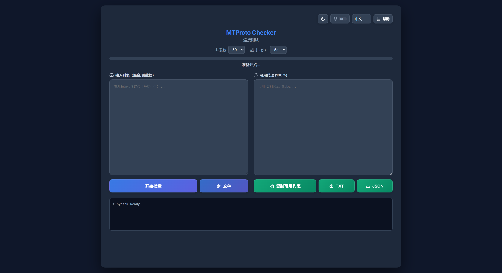

# 🛡️ MTProto Checker

[Read in English](README.md) | [На русском](README_RU.md) | [中文](README_ZH.md) | [فارسی](README_FA.md)

一个强大的 **Telegram MTProto 代理** 验证工具，通过执行真实协议握手来检测代理。与简单的 TCP 检查器不同，此工具尝试通过代理获取实际的服务器配置，确保 100% 的连接性。



## 🌟 功能特点

* **深度检测:** 通过代理执行真实的 MTProto 握手并调用 `help.getNearestDC` — 不是 TCP ping，「可用」意味着 Telegram 真正能连上。
* **Go 后端:** 基于 `gotd/td` — 快速、稳定，单个 ~21MB 二进制文件，无依赖。
* **随意粘贴:** 脏列表自动清理 — 修复格式错乱的 `tg://` / `https://t.me` 链接，丢弃垃圾密钥和无效端口；无需手机号登录（公开测试密钥）。
* **三种方式加载列表:** 粘贴文本、选择 `.txt`/`.csv`/`.list` 文件，或将文件拖放到输入框。
* **暂停/继续:** 随时暂停检查，继续时不会重复检查已完成的代理。
* **即用的结果:** 可用代理进入按延迟排序的表格 — 支持逐行复制、纯文本视图和 TXT/JSON 导出。
* **界面:** 暗色与亮色主题，四种语言（中文、英文、波斯语、俄语）。

## 🚀 安装

### 方式 1 — 从 Releases 下载

从 [Releases](../../releases) 下载适用于您平台的预编译二进制文件。

| 平台 | 文件 |
|------|------|
| Windows (amd64) | `mtproto-checker-windows-amd64.exe` |
| Linux (amd64) | `mtproto-checker-linux-amd64` |
| Linux (arm64) | `mtproto-checker-linux-arm64` |
| macOS (Intel) | `mtproto-checker-darwin-amd64` |
| macOS (Apple Silicon) | `mtproto-checker-darwin-arm64` |

运行后，服务器启动完成时浏览器会自动打开绑定的地址（默认为 `http://127.0.0.1:3000`）。设置 `NO_BROWSER=1` 可禁用自动打开；当 `HOST` 设置为非回环地址时（例如无图形界面服务器使用 `HOST=0.0.0.0`），也会自动跳过。如果浏览器启动失败，服务器会继续运行——请手动打开日志中打印的地址。

> 服务器仅监听 `127.0.0.1`。通过环境变量 `PORT` 更改端口；设置 `HOST=0.0.0.0` 可向网络开放——没有任何身份验证，请谨慎启用。

### 方式 2 — 从源码构建

需要 **Go 1.26.3+**（与 `go.mod` 中的 `go` 指令一致）。[下载 Go](https://go.dev/dl/)。

```bash
git clone https://github.com/rahgozar94725/MTProto-Checker.git
cd MTProto-Checker
go build -o mtproto-checker .
./mtproto-checker
```

> 二进制文件：~21MB，无其他依赖。

## 📖 使用方法

1.  **获取代理:** 复制您的 MTProto 代理列表。
    > **提示:** 您可以在[此仓库](https://github.com/SoliSpirit/mtproto)找到大量免费代理。
2.  **加载列表:** 粘贴到 **"输入列表"** 框中，点击 **"文件"**，或将文件拖放到输入框。
3.  **开始检查:** 点击 **"开始检查"** 按钮。
4.  **等待:** 先过滤无效格式，然后分批测试连接，进度实时显示。
5.  **收集结果:** 可用代理按延迟从快到慢显示在结果表中 — 可逐行复制、点击 **"复制可用列表"**，或导出为 TXT/JSON。

## 🔌 HTTP API

界面使用 `POST /check-stream`（Server-Sent Events）。脚本请使用受支持的端点 `POST /check`，每个请求一个代理：

```bash
curl -s http://127.0.0.1:3000/check \
  -H 'Content-Type: application/json' \
  -d '{"server":"1.2.3.4","port":443,"secret":"ee...","timeout":10}'
# {"ok":true,"ping":123}  或  {"ok":false}
```

`timeout` 单位为秒，限制在 3–30 之间（默认 5）。请求体上限为 8 MiB，批量请求最多接受 10 000 个代理（超过任一限制返回 HTTP `413`）。

> `POST /check-batch` 已**弃用**：目前仍可用，但响应会带有 `Deprecation: true` 头，并将在未来版本中移除。脚本请使用 `/check`，流式结果请使用 `/check-stream`。

## ⚙️ 工作原理

此工具在后台运行一个真实的 Telegram 客户端，并像手机应用一样连接数据中心 — 连接成功即代表代理确实可用。许多代理能响应 TCP 连接，但无法加密/解密 Telegram 数据包（虚假代理）。

1.  **解析与清理:** 修复损坏的链接（例如 `.&port` 输入错误）。
2.  **验证密钥:** 拒绝过长（垃圾填充）或无效的密钥。
3.  **建立连接:** 通过代理建立安全的 MTProto 连接。
4.  **调用 API:** 向 Telegram 数据中心发送 `help.getNearestDC` 请求。
5.  **结果:** 如果服务器回复，则代理标记为 **可用** 并显示延迟。

## 🛠 技术

* [gotd/td](https://github.com/gotd/td) — 支持原生 MTProxy 的 MTProto API 客户端
* Vanilla HTML/CSS/JS 前端 — 无框架、无构建步骤
* 单二进制文件，无外部依赖

## ☕ 支持

如果您觉得此工具有用，可以支持开发：

<a href="https://nowpayments.io/donation?api_key=d824db3b-fcf7-4ebb-8e3d-297c23cfeee2" target="_blank" rel="noreferrer noopener">
    
</a>

## 📝 许可证

本项目为开源项目，基于 [MIT 许可证](LICENSE)。
